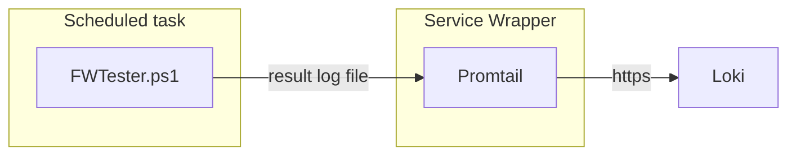

# FWTester
Script powershell permetant de tester des flux reseaux depuis une source vers des cibles multiples. Avec schedule de lancement, et centralisation des resultats.

Les deux types de test possibles sont

- **OSI layer 5** : TCP/IP + DNS via test socket TCP
- **OSI layer 7** : HTTP/s via test web request

## Flowchart

Pour chaque machine source sur laquel le script est présent, il faut :

- un fichier [hostname].csv contenant les regles a tester depuis la source 
- un agent promtail configuré, via promtail-config-win.yaml
- un service wrapper encapsulant l'agent promtail
- une scheduled task lanceant le powershell toutes les heures

## Installation sur une machine

### Creation des dossiers et depot des executables/confs sur le disque E:

    E:\FWTester\log\result
    E:\FWTester\log\transcript
    E:\FWTester\FWTester.ps1
    E:\FWTester\[hostname].csv
    E:\Promtail\promtail-service-wrapper.exe
    E:\Promtail\promtail-windows-amd64.exe
    E:\Promtail\promtail-service-wrapper.xml
    E:\Promtail\promtail-config-win.yaml

### Installation du service 

Si le disque n'est pas E:, mettre a jour le fichier promtail-service-wrapper.xml

Ouvrir une console cmd dans le dossier E:\Promtail et lancer la commande 

    E:\promtail>promtail-service-wrapper.exe install promtail-service-wrapper.xml

Lancer le service depuis le gestionnaire des services windows, il se relancera automatiquement lors des potentiels reboot machine.

### Creation de la scheduled task

Tache planifie qui lance le fichier powershell de test toute les heures. **L'utilisation d'un utilisateur, a minima de service est necessaire (params /ru /rp)** car le comportement des requetes http n'est pas le meme via un script lancé par le system, et les test ne seront pas representatifs. Si aucun test HTTP n'est prévu, il est possible de schéduler une éxecution par le system via **/ru System**

    schtasks /create /sc hourly /mo 1 /tn FLUX\FWTester /tr "PowerShell E:\FWTester\FWTester.ps1" /ru adminapp.gco /rp "xxxxxx"

### Pour administer si besoins la tache 

voir l'etat 

    schtasks /query | findstr FWTester

run

    schtasks /run /tn FLUX\FWTester

delete 
 
    schtasks /delete /tn FLUX\FWTester

## Configuration des tests

Pour chaque ligne de test dans le fichier csv, il faut

- **Tag** : champ libre permetant de filter/ regrouper les resultat plus facilement
- **Host** : url ou fqdn de la cible
- **Port** : port de la cible dans le cas d'un test TCP
- **Test** : TCP , HTTP (ou HTTPS)