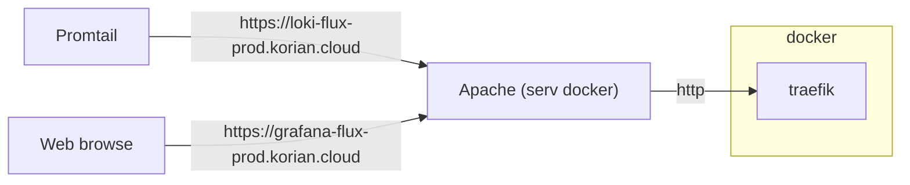
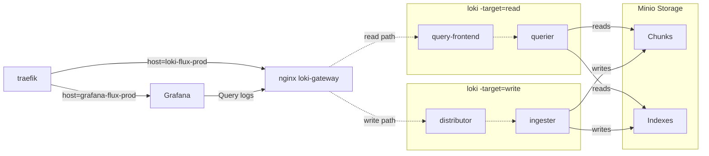

# Monitoring ATD flux/esb/...

Projet de monitoring opérationnel, couvrants différents axes. Basé sur une stack grafana/loki/promtail/nodejs. Permettant de générer et centraliser des logs. Ces logs sont ensuite exploitables directement ou via des dashboards de suivi opérationnels.

## Contenue de dossier du projet

- **FWTester** : outil de test automatisé de regles firewall avec centralisation des resultats via Loki/promtail
- **Grafana dashboards** : contient un backup JSON des dashboards grafana de production
- **grafana_loki_compose_prod** : template de deploiement docker prod pour grafana/loki dans l'environement de l'equipe dev, comprenant integration Traefik
- **grafana_loki_compose_rec** : template de depoiement docker recette pour grafana/loki
- **helm_charts** : exemple de charts de ploiement helm pour installation grafana/loki sur kubernetes
- **pentaho_mon** : application de monitoring multi source en NodeJS, present sur le xxxxxxxxx. Les resultats sont centralisés dans loki.

## Flowchart grafana/loki

cf la [doc oficielle]([https://](https://github.com/grafana/loki/tree/main/production/docker)). Les subtilités Korian sont la mise en place du apache httpd pour porter les certificats https, et le reverse proxy traefik en front du serveur docker.

## Focus sur le depoyment docker prod

## Configuration Grafana production

Il y a 2 organisations sur la plateforme

- **Main Org.** utilisée par les utilisateurs nominatifs
- **public** accessible au utilisateurs anonymes, entre autre le kiosk(tv)

Les configurations de datasources et de dashboards sont distinctes entre les deux plateformes. **Il faut donc maintenir les dashboards public ainsi que ceux de la Main Org.** Pour maintenir les dashboards de la main org, utiliser le user **adminflux**, qui a acces en administration aux 2 organisations.

## Dashboard examples

### Application log volume 

### Firewall rules tester

### Loki ingested data

### Monitoring ESB et Flux 

### Planning vs actual runs

