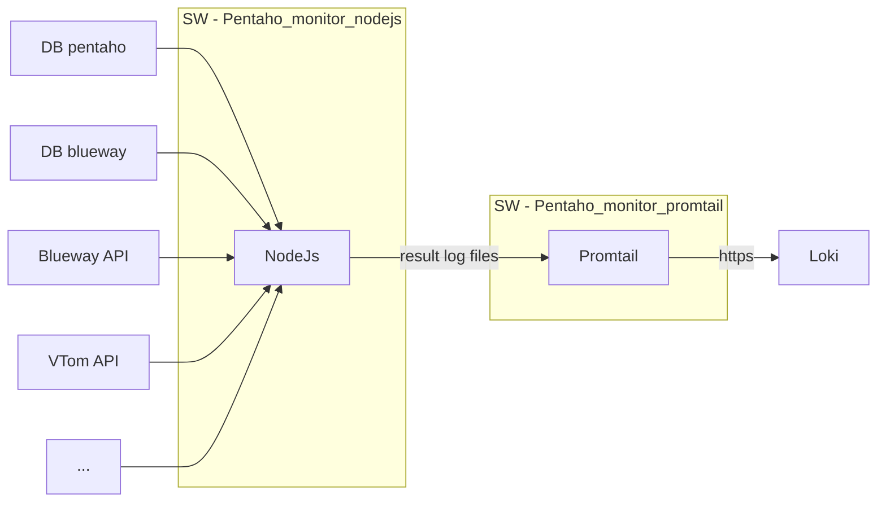

# Pentaho_mon
Le nom porte a confusion car on ne monirot plus que du pentaho, mais bon...

Prod presente sur le kor0223vm-pen

SW = Service wrapper

- **\dist** : fichiers genere par Typescript
- **\param** : contient le fichier de parametrage des endpoints a tester
- **\src** : sources typescript, c'est ici qu'on dev
- **.env.prod** : variables d'environements de la production
- **npm_start.bat** : script de lancement utilisé par le SW
- **service-wrapper.xml** : conf utilisé pour l'installation du service encapsulant NodeJs

## Flowchart

## instalation du serveur nodeJs sur le kor0223vm
Dossier d'intallation cibles:

    \\kor0223vm-pen\c$\Korian\Apps\nodejs
                                  \pentaho-mon
                                  \promtail
Ajout de la conf proxy pour npm : 

    npm config set proxy http://proxy-cloud.korian.cloud:80
    npm config set https-proxy http://proxy-cloud.korian.cloud:80

Pour rapatrier les package nodes, dans le dossier pentaho-mon sur la cible

    npm i 

En cas d'erreur, les logs du nodejs sont elles meme disponible dans loki sour lenom d'application  : Monitoring_nodejs

